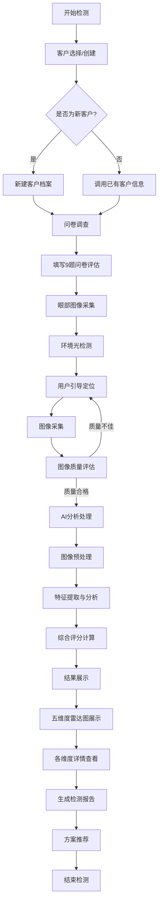
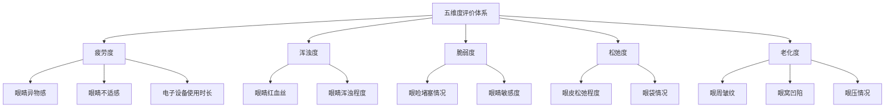
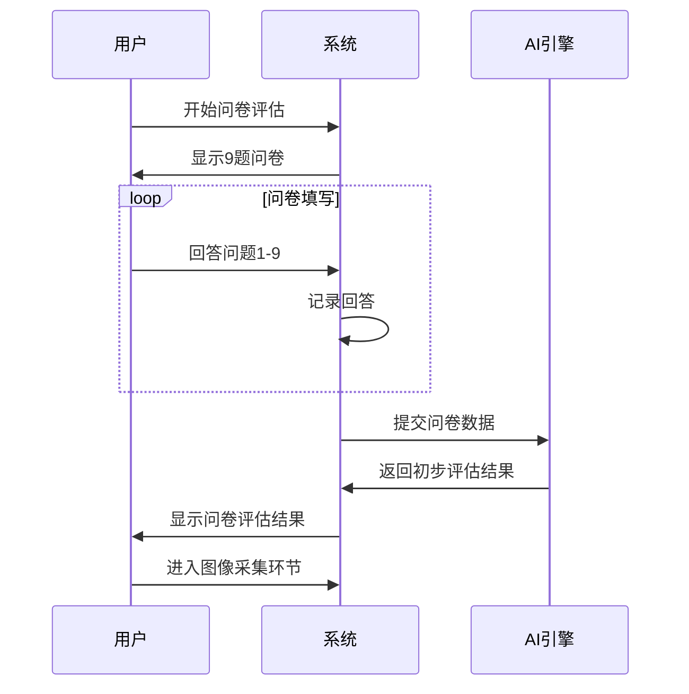
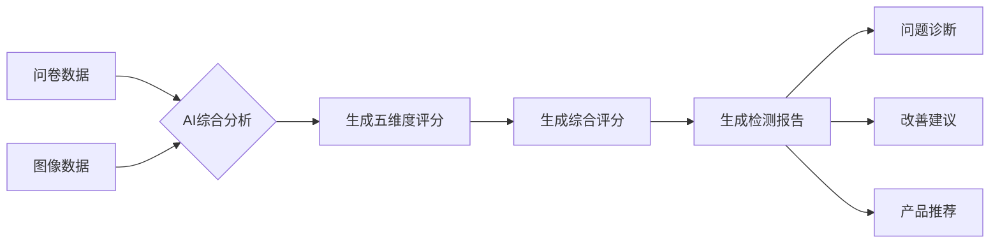

# 美睛美科平板App眼部检测主流程

## 主要检测流程图

```mermaid
flowchart TD
    A[开始检测] --> B[客户选择/创建]
    B --> B1{是否为新客户?}
    B1 -->|是| B2[新建客户档案]
    B1 -->|否| B3[调用已有客户信息]
    B2 --> C
    B3 --> C
    
    C[问卷调查] --> C1[填写9题问卷评估]
    C1 --> D[眼部图像采集]
    
    D --> D1[环境光检测]
    D1 --> D2[用户引导定位]
    D2 --> D3[图像采集]
    D3 --> D4[图像质量评估]
    D4 -->|质量不佳| D2
    D4 -->|质量合格| E
    
    E[AI分析处理] --> E1[图像预处理]
    E1 --> E2[特征提取与分析]
    E2 --> E3[综合评分计算]
    
    E3 --> F[结果展示]
    F --> F1[五维度雷达图展示]
    F1 --> F2[各维度详情查看]
    F2 --> F3[生成检测报告]
    
    F3 --> G[方案推荐]
    G --> H[结束检测]
```

## 五维度评价体系

```mermaid
graph TD
    A[五维度评价体系] --> B[疲劳度]
    A --> C[浑浊度]
    A --> D[脆弱度]
    A --> E[松弛度]
    A --> F[老化度]
    
    B --> B1[眼睛异物感]
    B --> B2[眼睛不适感]
    B --> B3[电子设备使用时长]
    
    C --> C1[眼睛红血丝]
    C --> C2[眼睛浑浊程度]
    
    D --> D1[眼睑堵塞情况]
    D --> D2[眼睛敏感度]
    
    E --> E1[眼皮松弛程度]
    E --> E2[眼袋情况]
    
    F --> F1[眼周皱纹]
    F --> F2[眼窝凹陷]
    F --> F3[眼压情况]
```

## 问卷评估流程

```mermaid
sequenceDiagram
    participant 用户
    participant 系统
    participant AI引擎
    
    用户->>系统: 开始问卷评估
    系统->>用户: 显示9题问卷
    
    loop 问卷填写
        用户->>系统: 回答问题1-9
        系统->>系统: 记录回答
    end
    
    系统->>AI引擎: 提交问卷数据
    AI引擎->>系统: 返回初步评估结果
    系统->>用户: 显示问卷评估结果
    用户->>系统: 进入图像采集环节
```

## 检测报告生成流程

```mermaid
flowchart LR
    A[问卷数据] --> C{AI综合分析}
    B[图像数据] --> C
    C --> D[生成五维度评分]
    D --> E[生成综合评分]
    E --> F[生成检测报告]
    F --> G1[问题诊断]
    F --> G2[改善建议]
    F --> G3[产品推荐]
```
