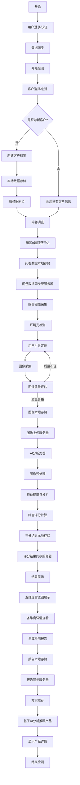
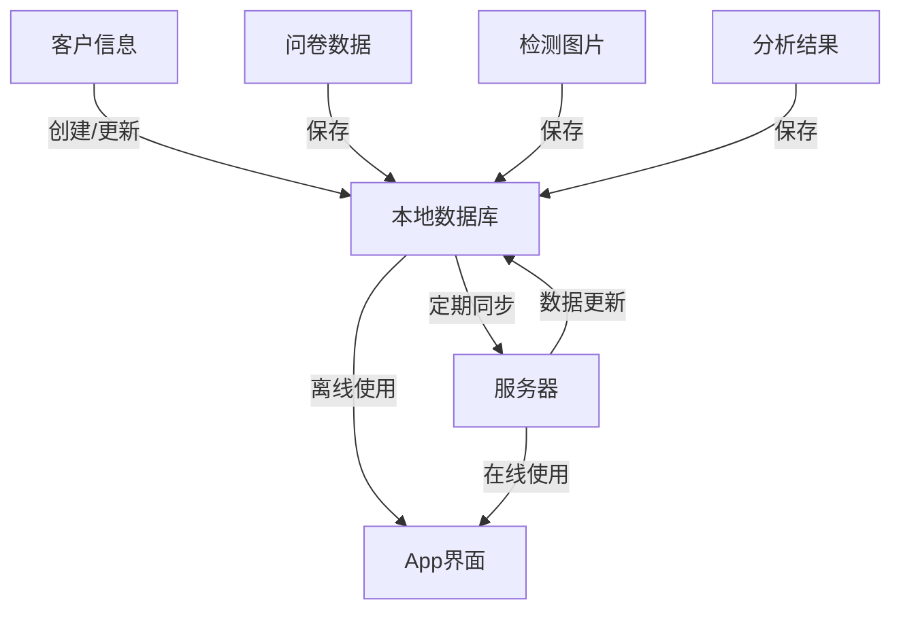
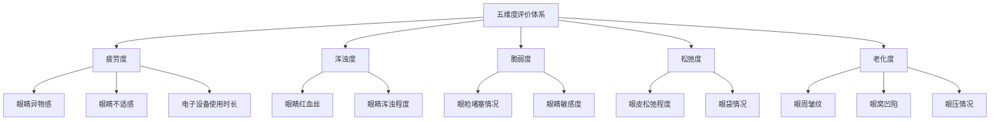

# 美睛美科平板App眼部检测主流程

## 主要检测流程图

## 数据流转说明

## 五维度评价体系

## 离线功能支持

1. 本地数据存储
   - SQLite数据库
   - 本地文件系统（图片存储）
   - 本地缓存机制

2. 数据同步策略
   - 定时同步
   - 手动同步
   - 网络恢复自动同步
   - 冲突解决机制

3. 离线检测支持
   - 完整检测流程支持
   - 本地AI模型
   - 数据临时存储
   - 后续同步机制

## 系统权限要求

1. 必需权限
   - 相机权限
   - 存储权限
   - 网络权限

2. 可选权限
   - 位置信息
   - 设备信息

## 异常处理机制

1. 网络异常
   - 本地模式切换
   - 数据缓存
   - 重试机制

2. 设备异常
   - 相机异常处理
   - 存储空间不足提示
   - 电量不足提示

3. 服务器异常
   - 降级服务
   - 本地模式
   - 错误提示

## 数据安全

1. 本地数据
   - 数据加密存储
   - 敏感信息保护
   - 定期清理机制

2. 传输安全
   - HTTPS传输
   - 数据加密
   - Token认证

3. 权限管理
   - 用户角色权限
   - 数据访问控制
   - 操作审计
