****# 美睛美科营销一体化系统技术方案

| 日期 | 变更说明 | 修改人 | 备注 |
|------|---------|------|------|  
| 2025/3/5 | 初稿，梳理业务流程、确定业务架构、技术栈选型、业务子流程梳理 | jingwenlai | 

 

一、项目概述
"美睛美科营销一体化系统"是一套以AI眼部健康检测为核心，连接用户、门店、产品的智能化解决方案。系统通过平板端采集用户眼周图像，结合OSDI干眼问卷，运用AI算法进行眼部健康评估，生成个性化产品推荐和护理方案，实现从"检测-分析-干预-复购"的闭环营销。

1.1 业务全景图（C4模型）
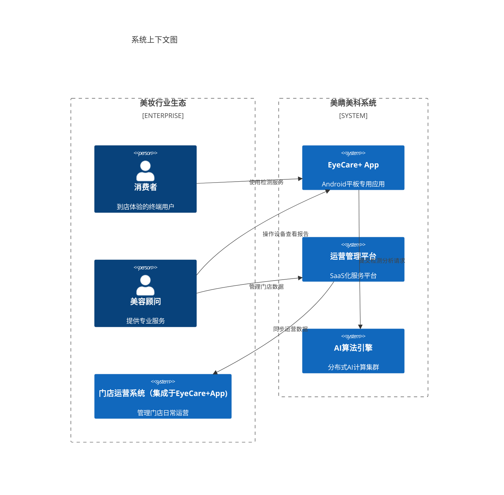

1.2 项目目标
构建眼健康检测的数字化、智能化平台
提升用户眼健康认知和品牌体验
增强门店营销转化能力和客户留存率
建立数据驱动的经营决策系统
1.3 系统定位

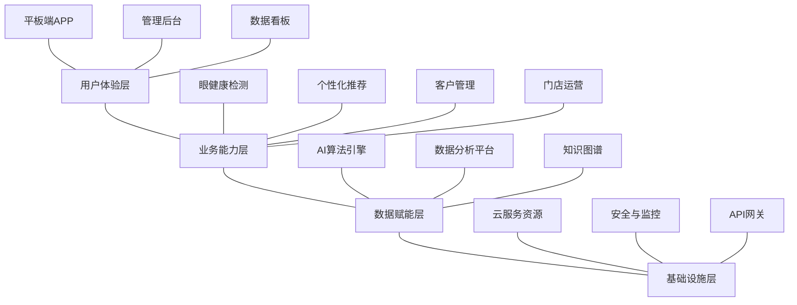

## 二、系统技术架构

### 2.1 整体架构

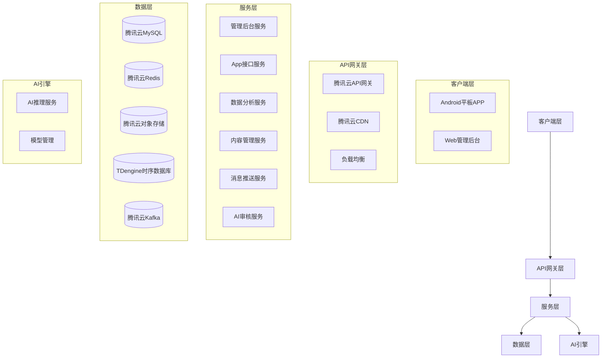

### 2.2 数据流设计

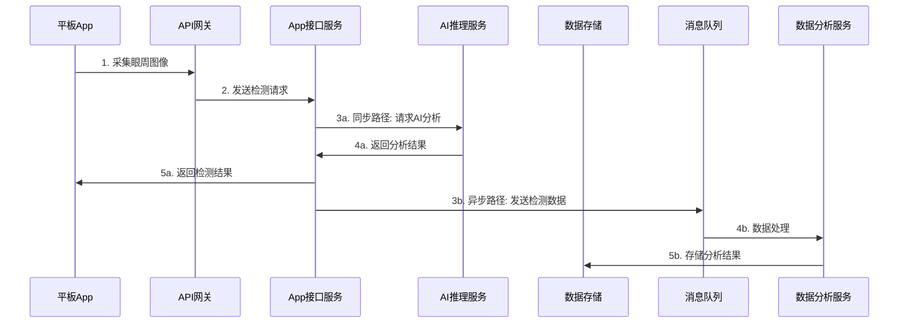

## 三、系统技术栈

### 3.1 后端技术栈

| 类别 | 技术选型 | 说明 |
|------|---------|------|
| 开发语言 | Go 1.22+ | 复用现有项目框架 |
| Web框架 | Gin | 高性能Go Web框架 |
| ORM框架 | GORM | Go语言ORM库 |
| 数据库 | 腾讯云MySQL | 主从架构，数据持久化 |
| 缓存 | 腾讯云Redis | 高可用集群，会话和热点数据缓存 |
| 对象存储 | 腾讯云COS | 图片和大文件存储 |
| 时序数据库 | TDengine | 检测数据时序存储和分析 |
| 消息队列 | 腾讯云CKafka | 解耦系统组件，异步处理 |
| 容器编排 | 腾讯云TKE | Kubernetes容器管理服务 |
| API网关 | 腾讯云API网关 | 统一服务入口，认证授权 |
| 日志系统 | 腾讯云CLS | 日志收集和分析 |
| 服务网格 | Istio | 流量管理和微服务通信 |

### 3.2 前端技术栈

| 类别 | 技术选型 | 说明 |
|------|---------|------|
| Android应用 | Kotlin | 平板端应用开发语言 |
| Android架构 | MVVM + Jetpack | 现代Android应用架构 |
| 网络请求 | Retrofit + OkHttp | RESTful API客户端 |
| 数据存储 | Room | 本地SQLite抽象层 |
| 图像处理 | CameraX + OpenCV | 摄像头控制和图像处理 |
| AI集成 | TensorFlow Lite | 端侧AI模型部署 |
| 管理后台 | React + TypeScript | 复用现有项目架构 |
| UI组件库 | Ant Design Pro | 企业级中后台UI框架 |
| 状态管理 | Redux | 前端状态管理 |
| 数据可视化 | ECharts | 交互式图表库 |

### 3.3 AI技术栈

| 类别 | 技术选型 | 说明 |
|------|---------|------|
| 深度学习框架 | TensorFlow/PyTorch | 模型训练和开发 |
| 推理服务 | TensorFlow Serving | 模型部署和推理 |
| 加速优化 | TensorRT | 深度学习模型优化和加速 |
| 模型管理 | MLflow | 模型版本控制和实验管理 |
| 计算机视觉库 | OpenCV | 图像预处理和分析 |
| 轻量级模型 | TFLite/CoreML | 移动端模型部署 |

## 四、平台功能架构

### 4.1 功能架构图

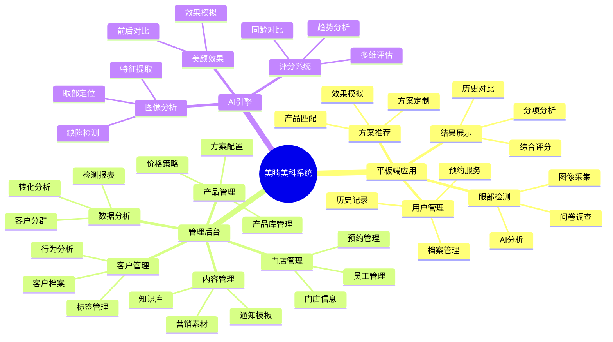

## 五、平台功能列表

### 5.1 平板端应用功能
***供参考，前期只做核心功能***
| 功能模块 | 功能项 | 优先级 | 功能描述 |
|---------|--------|--------|---------|
| **用户管理** | 用户注册登录 | P0 | 支持手机号注册/登录、微信授权登录(P2) |
| | 用户资料管理 | P1 | 基础信息维护，包括姓名、年龄、性别等 |
| | 历史记录查看 | P0 | 查看历次检测记录和评分变化趋势 |
| **眼部检测** | 检测流程引导 | P0 | 通过分步骤引导完成眼部图像采集 |
| | 环境光检测 | P1 | 检测环境光线是否适合拍摄，并给出调整建议 |
| | 多角度采集 | P0 | 引导用户完成整脸光照合适条件下的眼周图像采集 |
| | OSDI问卷调查 | P1 | 标准干眼症状评估问卷填写 |
| **结果展示** | 综合评分展示 | P0 | 显示眼健康综合评分和等级 |
| | 多维度分析 | P0 | 黑眼圈、眼纹、眼袋等多维度评估结果 |
| | 专业解读 | P1 | 对检测结果进行专业术语解释和说明 |
| | 同龄人对比 | P2 | 与同龄人群眼健康状况进行对比分析 |
| **方案推荐** | 个性化方案 | P0 | 基于检测结果推荐个性化护理方案 |
| | 产品推荐 | P0 | 匹配适合的眼部护理产品 |
| | 效果模拟 | P1 | AI模拟护理后的效果预览 |
| | 方案对比 | P2 | 多方案效果对比和选择 |
| **离线工作** | 本地存储 | P1 | 无网络环境下本地保存检测数据 |
| | 数据同步 | P1 | 网络恢复后自动同步本地数据至云端 |
| | 本地AI推理 | P2 | 支持离线环境下的AI分析能力 |

### 5.2 管理后台功能

| 功能模块 | 功能项 | 优先级 | 功能描述 |
|---------|--------|--------|---------|
| **客户管理** | 客户列表 | P0 | 客户基础信息管理和查询 |
| | 客户档案 | P0 | 客户详细信息、检测记录、购买历史等管理 |
| | 客户标签 | P1 | 客户分群和标签管理 |
| | 跟进记录 | P1 | 客户沟通和服务记录管理 |
| **门店管理** | 门店信息 | P0 | 门店基础信息管理 |
| | 员工管理 | P0 | 员工账号和权限管理 |
| | 预约管理 | P1 | 客户预约服务的管理和安排 |
| | 业绩统计 | P1 | 门店销售业绩统计和分析 |
| **产品管理** | 产品库 | P0 | 眼部护理产品和服务管理 |
| | 方案配置 | P1 | 标准化护理方案配置 |
| | 价格策略 | P1 | 产品定价和促销策略管理 |
| | 库存管理 | P2 | 产品库存及门店调拨管理 |
| **数据分析** | 检测分析 | P0 | 检测数据多维度统计分析 |
| | 转化分析 | P1 | 检测到购买的转化率分析 |
| | 区域分析 | P2 | 基于地理位置的数据分布分析 |
| | 自定义报表 | P2 | 支持自定义数据分析报表 |
| **内容管理** | 知识库 | P1 | 眼健康知识内容管理 |
| | 营销素材 | P1 | 营销活动素材管理 |
| | 通知模板 | P2 | 消息推送模板管理 |
| **系统设置** | 账号管理 | P0 | 后台账号和权限管理 |
| | 角色配置 | P0 | 基于RBAC的角色权限配置 |
| | 操作日志 | P1 | 系统操作审计日志 |
| | 系统参数 | P1 | 全局系统参数配置 |

### 5.3 AI引擎功能

| 功能模块 | 功能项 | 优先级 | 功能描述 |
|---------|--------|--------|---------|
| **图像分析** | 人脸检测 | P0 | 检测图像中的人脸位置 |
| | 眼部定位 | P0 | 精确定位眼部及眼周区域 |
| | 特征提取 | P0 | 提取眼周特征点和区域特征 |
| **缺陷检测** | 黑眼圈检测 | P0 | 检测和评估黑眼圈严重程度 |
| | 眼纹检测 | P0 | 检测和评估眼纹分布和深度 |
| | 眼袋检测 | P1 | 检测和评估眼袋情况 |
| | 结膜充血检测 | P2 | 检测眼睛红血丝情况 |
| **评分系统** | 综合评分 | P0 | 基于多维特征计算眼健康综合评分 |
| | 分项评分 | P0 | 各项指标的单独评分 |
| | 评分规则配置 | P1 | 支持评分规则的动态配置 |
| **美颜效果** | 效果模拟 | P1 | 模拟护理后的眼周状态 |
| | 前后对比 | P1 | 生成使用前后的对比效果 |
| **模型管理** | 版本控制 | P0 | AI模型版本管理 |
| | 模型评估 | P1 | 模型效果评估和对比 |
| | 增量学习 | P2 | 基于新数据的模型迭代优化 |

## 六、功能模块详细说明

### 6.1 眼部检测流程 (P0)
***核心检测流程，算法结合端侧及云端，主要在App端呈现，云端采集数据及提供审计，便于后续持续优化***

眼部检测是系统的核心功能，整体流程如下：

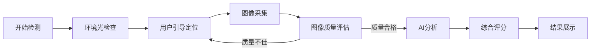

**关键技术点：**

1. **环境光检查**：**分析当前光线是否适合拍摄**，不足时提供调整建议
2. **用户引导定位**：通过UI引导用户将眼部对准指示框
3. **图像采集**：
   - 使用Camera2 API控制相机参数
   - 支持自动对焦和曝光控制
   - 多帧图像采集，自动选择最清晰的一帧
4. **图像质量评估**：
   - 检测模糊度、亮度、构图是否符合要求
   - 不合格时提示用户重新采集
5. **AI分析**：
   - 端云结合的分析模式
   - 轻量级预处理在端侧进行
   - 复杂分析在云端AI服务完成

### 6.2 评分系统设计 (P0)
***核心功能，P0，云端管理系统针对该项做成可配置，App端同步（App在无联网时可采用本地版本），做成通用版本及门店特定版本兼容方式，前期业务验证阶段，可针对不同门店设定不同规则进行对比***
评分系统整合AI检测和问卷调查结果，生成综合评分：

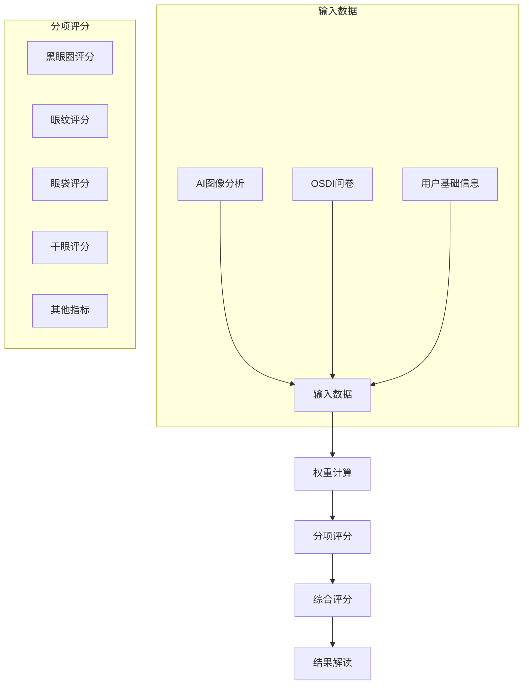

**评分规则：**

1. 综合评分（0-100分）根据各分项得分加权计算
2. 每个分项根据严重程度划分为5级（无、轻微、中度、较重、严重）
3. 权重可根据门店特点和产品重点进行定制调整
4. 最终得分对应健康等级：优秀(90-100)、良好(80-89)、一般(70-79)、较差(60-69)、需改善(<60)

### 6.3 个性化推荐系统 (P1)
***优先级P1，前期可用模板替代，不做独立系统，后续可进一步扩展***
基于用户检测结果，系统自动匹配最适合的产品和服务：

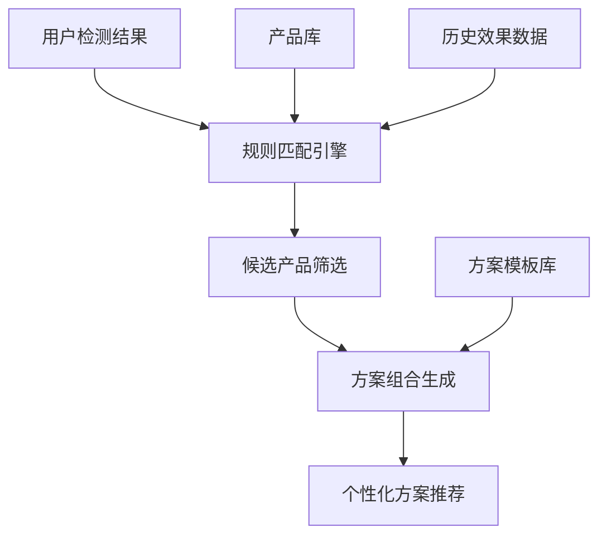

**推荐流程：**

1. 根据眼部问题特点，筛选对应功效的产品
2. 基于问题严重程度，推荐合适的使用周期和频次
3. 组合多个单品形成标准化方案（基础/标准/高级）
4. 考虑用户年龄、性别、历史购买行为等进行个性化调整
5. 展示推荐方案的预期效果和适用原理

### 6.4 数据分析系统 (P2)
***优先级P2，辅助后期运营分析与优化***

数据分析系统提供多维度的业务数据可视化和洞察：

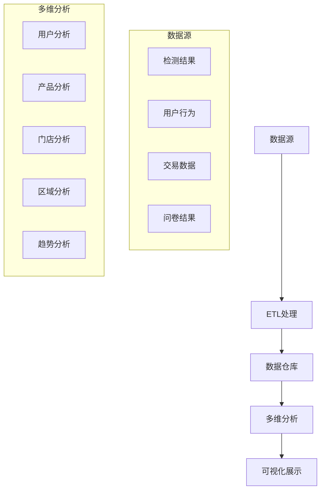

**分析维度：**

1. **用户分析**：用户画像、行为路径、生命周期价值
2. **产品分析**：产品受众、转化率、复购率
3. **门店分析**：客流量、业绩达成、检测转化率
4. **区域分析**：区域分布、热力图、区域间对比
5. **趋势分析**：时间序列分析、季节性波动、增长预测

## 七、系统部署拓扑

### 7.1 生产环境部署架构

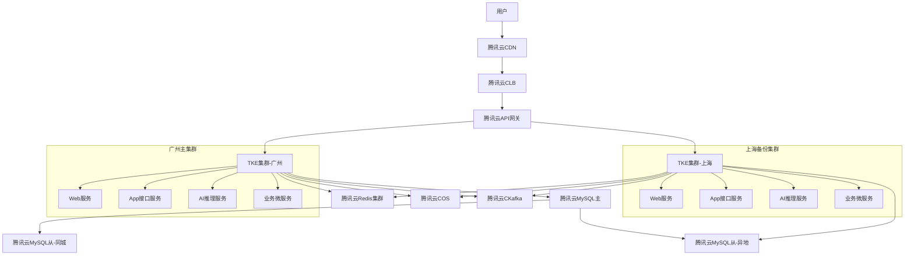

### 7.2 多环境部署策略
***前期暂不考虑跨区域部署，后续视业务发展情况再决定***

| 环境 | 部署方式 | 配置 | 用途 |
|-----|---------|-----|------|
| 开发环境 | 单节点部署 | 4核8G，50G SSD | 开发人员日常开发和调试 |
| 测试环境 | 单集群部署 | 控制平面：3节点，4核8G 工作节点：3节点，8核16G | 功能测试、集成测试、性能测试 |
| 预发环境 | 单集群部署 | 控制平面：3节点，8核16G 工作节点：3节点，16核32G | 与生产环境配置相同，用于发布前验证 |
| 生产环境 | 多集群跨区域部署 | 控制平面：3节点，8核16G 应用节点：自动伸缩，最小6节点，16核32G 数据节点：4节点，16核64G | 线上服务 |

## 八、软硬件清单

### 8.1 软件清单
***基于腾讯云部署后台管理系统，基础服务及GPU推理服务采购腾讯云，部署自有业务系统***
| 类别 | 名称 | 版本 | 说明 |
|-----|------|-----|------|
| 基础OS | CentOS | 7.9 | 服务器操作系统 |
| 容器平台 | 腾讯云TKE | 企业版 | Kubernetes容器服务 |
| 数据库 | 腾讯云MySQL | 5.7 | 关系型数据库 |
| 缓存服务 | 腾讯云Redis | 5.0 | 缓存服务 |
| 对象存储 | 腾讯云COS | - | 对象存储服务 |
| 消息队列 | 腾讯云CKafka | - | 消息队列服务 |
| 时序数据库 | TDengine | 2.6 | 时序数据存储 |
| 日志服务 | 腾讯云CLS | - | 日志服务 |
| 监控服务 | 腾讯云监控 | - | 系统监控 |
| API网关 | 腾讯云API网关 | - | API管理 |
| CDN服务 | 腾讯云CDN | - | 内容分发网络 |
| 负载均衡 | 腾讯云CLB | - | 负载均衡服务 |
| CICD工具 | 腾讯云CODING DevOps | - | 持续集成/部署 |
| 推送服务 | 腾讯云TPNS | - | 消息推送服务 |

### 8.2 硬件设备需求（平板端）
***以下配置供参考，本项目已有酷比魔方平板做为门店检测平板***
| 项目 | 最低配置 | 推荐配置 | 说明 |
|-----|---------|---------|------|
| 平板型号 | Android 8.0以上平板设备 | 三星Galaxy Tab S7/华为MatePad Pro | 用于门店检测 |
| 处理器 | 骁龙662及以上 | 骁龙865及以上 | 保证AI推理性能 |
| 内存 | 4GB | 8GB及以上 | 保证应用流畅性 |
| 存储 | 64GB | 128GB及以上 | 存储离线数据 |
| 摄像头 | 800万像素后置摄像头 | 1200万像素及以上后置摄像头 | 确保图像质量 |
| 屏幕 | 10.1英寸，1920×1200 | 11英寸及以上，2560×1600 | 良好展示效果 |
| 网络 | WiFi 5 | WiFi 6 + 4G/5G | 保证数据传输速度 |
| 电池 | 6000mAh | 8000mAh及以上 | 保证续航能力 |

## 九、预期效果

### 9.1 业务指标
***以下仅供参考，商业上转化率暂时不定，平台提供能力支撑***

| 指标类别 | 指标名称 | 目标值 | 说明 |
|---------|---------|--------|------|
| 转化指标 | 检测-咨询转化率 | ≥60% | 完成检测后进行专业咨询的比例 |
| | 咨询-购买转化率 | ≥40% | 咨询后完成产品购买的比例 |
| | 整体转化率 | ≥25% | 检测到最终购买的转化率 |
| 运营指标 | 日均检测量 | ≥15次/门店 | 单店日均完成检测的次数 |
| | 复检率 | ≥30% | 用户完成首次检测后30天内再次检测的比例 |
| | 会员留存率 | ≥70% | 使用产品3个月后的会员留存率 |
| 技术指标 | 检测响应时间 | ≤500ms | AI分析结果响应时间 |
| | 系统可用率 | ≥99.9% | 系统服务可用率 |
| | 数据同步成功率 | ≥99.99% | 离线数据同步成功率 |

### 9.2 AI模型效果

| 模型类别 | 指标名称 | 目标值 | 说明 |
|---------|---------|--------|------|
| 眼部检测 | 检测准确率 | ≥98% | 眼部区域定位准确率 |
| 黑眼圈检测 | 分类准确率 | ≥90% | 黑眼圈分级准确率 |
| | IoU得分 | ≥0.85 | 黑眼圈区域分割精度 |
| 眼纹检测 | 分类准确率 | ≥88% | 眼纹分级准确率 |
| | 检出率 | ≥90% | 眼纹检出率 |
| 美颜效果 | 自然度评分 | ≥4.2/5 | 美颜效果自然度主观评分 |
| | 用户满意度 | ≥85% | 用户对效果模拟的满意度 |

## 十、开发进度计划

### 10.1 总体进度

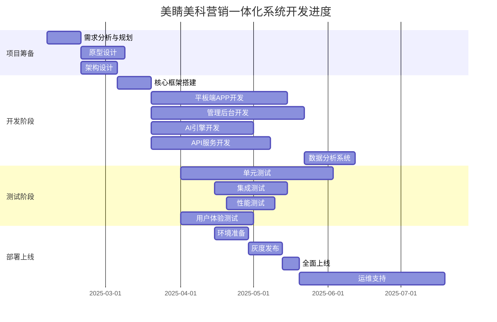

### 10.2 阶段性里程碑
***进度计划仅供参考***
| 里程碑 | 计划日期 | 交付物 | 负责团队 |
|-------|---------|--------|---------|
| 需求确认 | T+2周 | 需求规格说明书、原型初稿 | PM、业务分析 |
| 架构设计完成 | T+4周 | 系统架构文档、技术选型 | 架构师、技术负责人 |
| 开发环境就绪 | T+6周 | 开发环境部署文档 | 运维团队 |
| 核心功能完成 | T+16周 | 基础功能可演示版本 | 开发团队 |
| AI模型交付 | T+18周 | 训练完成的AI模型 | AI团队 |
| 功能冻结 | T+22周 | 全部功能完成版本 | 所有团队 |
| 测试完成 | T+26周 | 测试报告、问题修复清单 | 测试团队 |
| 系统上线 | T+28周 | 生产环境部署、上线确认 | 运维团队、PM |

### 10.3 资源配置计划
***现阶段人力受限，目前文档按总体规划，前期主要做业务验证，主做核心功能***
| 角色 | 人数 | 参与阶段 | 主要职责 |
|------|------|---------|---------|
| 产品经理 | 1 | 全程 | 需求管理、产品规划、进度控制 |
| 架构师 | 1 | 全程 | 系统架构设计、技术选型、质量把控 |
| 后端开发 | 3 | 开发阶段 | API开发、业务逻辑实现、数据处理 |
| 前端开发 | 2 | 开发阶段 | 管理后台开发、数据可视化 |
| Android开发 | 2 | 开发阶段 | 平板端APP开发、硬件适配 |
| AI工程师 | 2 | 开发阶段 | 算法开发、模型训练、模型部署 |
| 测试工程师 | 2 | 测试阶段 | 功能测试、性能测试、自动化测试 |
| UI/UX设计师 | 1 | 设计阶段 | 界面设计、交互设计、视觉设计 |
| 运维工程师 | 1 | 部署阶段 | 环境搭建、部署配置、监控告警 |

## 十一、风险评估与应对措施

| 风险点 | 影响级别 | 应对措施 | 责任人 |
|-------|---------|---------|-------|
| AI算法效果不达预期 | 高 | 1. 增加样本量和多样性 2. 引入专家评审机制 3. 准备备选算法方案 | AI架构师 |
| 平板端硬件兼容性问题 | 中 | 1. 明确支持的设备型号清单 2. 建立完善的兼容性测试矩阵 3. 开发硬件检测和提示功能 | Android开发负责人 |
| 数据安全合规风险 | 高 | 1. 进行专业的数据安全评估 2. 实施数据脱敏和加密机制 3. 建立完善的用户授权流程 | 架构师、法务 |
| 系统性能瓶颈 | 中 | 1. 进行压力测试和性能优化 2. 设计合理的缓存策略 3. 预留资源扩展空间 | 架构师、后端开发负责人 |
